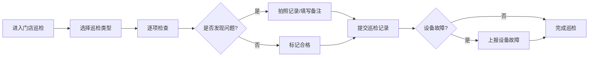

## 1. 产品概述

本产品是面向连锁便利店店长的 Web 端管理应用，帮助门店负责人高效处理日常运营工作，包括订货管理、商品陈列、人员排班、门店巡检等核心业务，实现门店运营的数字化和标准化管理。

- **目标用户**：连锁便利店门店店长及运营管理人员
- **核心价值**：提升门店运营效率，降低管理成本，确保标准化执行

## 2. 核心功能

### 2.1 用户角色

| 角色 | 登录方式 | 核心权限 |
|------|----------|----------|
| 门店店长 | 账号密码登录 | 所有页面功能访问、数据录入与修改、报表导出 |

### 2.2 功能模块

1. **首页看板**：销售数据概览、库存预警、临期商品提醒、待办事项
2. **商品管理**：商品信息查询、货架位置维护、陈列照片管理
3. **补货计划**：自动订货建议、手动调整订货量、到货验收记录
4. **促销执行**：总部促销任务领取、促销价签设置、促销效果追踪
5. **排班考勤**：班次安排、员工请假登记、考勤统计
6. **门店巡检**：卫生巡检记录、设备故障上报、整改追踪
7. **经营报表**：销售毛利分析、客单价统计、日报导出

### 2.3 页面详情

| 页面名称 | 模块名称 | 功能描述 |
|----------|----------|----------|
| 首页看板 | 数据概览卡片 | 今日销售额、订单数、客单价、毛利实时展示 |
| 首页看板 | 销售排行榜 | Top10 热销商品榜单，支持按销量/金额排序 |
| 首页看板 | 库存预警 | 低于安全库存的商品列表，红色高亮警示 |
| 首页看板 | 临期提醒 | 7天内到期商品列表，按到期天数分级显示 |
| 首页看板 | 待办事项 | 待处理订货、待验收、待巡检任务汇总 |
| 商品管理 | 商品列表 | 商品搜索、分类筛选、库存状态查看 |
| 商品管理 | 货架维护 | 可视化货架布局、商品陈列位置调整 |
| 商品管理 | 陈列照片 | 上传陈列照片、历史记录查看 |
| 补货计划 | 订货建议 | 系统自动生成订货建议，基于销量和库存 |
| 补货计划 | 订货调整 | 手动修改订货数量、添加备注 |
| 补货计划 | 到货验收 | 扫描/录入到货数量、差异记录、验收确认 |
| 促销执行 | 促销任务 | 总部下发的促销活动列表、任务领取 |
| 促销执行 | 价签设置 | 促销商品价格设置、价签打印预览 |
| 排班考勤 | 班次安排 | 周视图排班、员工班次拖拽调整 |
| 排班考勤 | 请假登记 | 员工请假申请、审批状态追踪 |
| 门店巡检 | 卫生巡检 | 巡检项清单、拍照记录、评分打分 |
| 门店巡检 | 设备故障 | 故障上报、照片上传、维修进度追踪 |
| 经营报表 | 销售分析 | 日/周/月销售趋势、毛利分析图表 |
| 经营报表 | 客单价分析 | 客单价趋势、客单价分布统计 |
| 经营报表 | 日报导出 | 日报数据查看、Excel/PDF 导出 |

## 3. 核心流程

### 3.1 补货订货流程

店长登录系统后，首页看板展示库存预警和待订货提醒。店长进入补货计划页面，查看系统自动生成的订货建议，可根据实际情况手动调整订货数量，确认后提交订货单。商品到货后，在到货验收模块核对商品数量，记录差异，完成验收。

### 3.2 门店巡检流程

店长每日按照巡检清单进行门店检查，对卫生、陈列、设备等项目逐一核查，发现问题拍照记录，对设备故障及时上报，系统追踪整改进度。

## 4. 用户界面设计

### 4.1 设计风格

- **主色调**：深蓝色 #165DFF（专业、可信）
- **辅助色**：橙色 #FF7D00（活力、警示）、绿色 #00B42A（成功）、红色 #F53F3F（危险）
- **中性色**：白色 #FFFFFF、浅灰 #F2F3F5、深灰 #4E5969
- **按钮风格**：圆角 6px，主按钮深蓝色填充，悬停有明暗变化
- **字体**：系统无衬线字体，标题字重 600，正文字重 400
- **布局风格**：左侧导航栏 + 顶部操作栏 + 卡片式内容区
- **图标风格**：线性图标，简洁清晰，使用 lucide-react 图标库

### 4.2 页面设计概览

| 页面名称 | 模块名称 | UI 元素 |
|----------|----------|----------|
| 首页看板 | 数据概览 | 4个统计卡片，带图标和趋势箭头 |
| 首页看板 | 排行榜 | 表格+进度条，前3名有奖牌图标 |
| 首页看板 | 预警列表 | 红色/橙色标签区分预警等级 |
| 商品管理 | 货架布局 | 网格布局可视化货架，支持拖拽 |
| 补货计划 | 订货建议 | 可编辑表格，支持批量调整 |
| 排班考勤 | 周排班 | 7列时间轴，拖拽调整班次 |
| 经营报表 | 图表 | 折线图+柱状图组合展示 |

### 4.3 响应式

- 桌面端优先设计（1920px 宽度适配）
- 支持平板设备自适应（≥768px）
- 左侧导航栏在小屏幕可折叠收起

### 4.4 交互细节

- 卡片悬停效果：轻微上浮 + 阴影加深
- 数据加载：骨架屏占位 + 渐入动画
- 表单提交：按钮 loading 状态 + 成功/失败提示
- 表格操作：行悬停高亮，操作列hover显示
