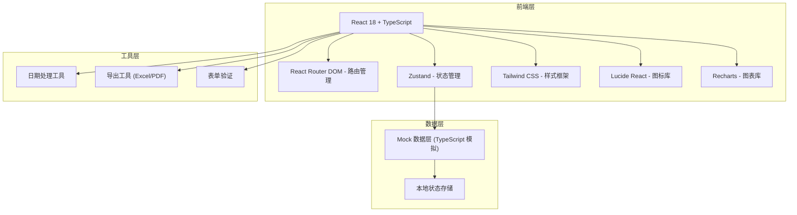

## 1. 架构设计



## 2. 技术说明

- **前端**：React 18 + TypeScript + Vite
- **初始化工具**：vite-init
- **后端**：纯前端项目，使用 Mock 数据模拟
- **状态管理**：Zustand
- **路由**：React Router DOM v6
- **样式**：Tailwind CSS v3
- **图表**：Recharts
- **图标**：Lucide React
- **数据持久化**：LocalStorage (可选)

## 3. 路由定义

| 路由 | 页面 | 说明 |
|------|------|------|
| /dashboard | 首页看板 | 销售数据概览、库存预警、临期提醒、待办事项 |
| /products | 商品管理 | 商品列表、货架维护、陈列照片 |
| /replenishment | 补货计划 | 订货建议、订货调整、到货验收 |
| /promotion | 促销执行 | 促销任务、价签设置 |
| /schedule | 排班考勤 | 班次安排、请假登记 |
| /inspection | 门店巡检 | 卫生巡检、设备故障 |
| /reports | 经营报表 | 销售分析、客单价分析、日报导出 |

## 4. 目录结构

```
src/
├── components/          # 公共组件
│   ├── Layout/         # 布局组件 (侧边栏、顶部导航)
│   ├── Card/           # 统计卡片组件
│   ├── Table/          # 表格组件
│   ├── Modal/          # 弹窗组件
│   └── Chart/          # 图表组件
├── pages/              # 页面组件
│   ├── Dashboard/      # 首页看板
│   ├── Products/       # 商品管理
│   ├── Replenishment/  # 补货计划
│   ├── Promotion/      # 促销执行
│   ├── Schedule/       # 排班考勤
│   ├── Inspection/     # 门店巡检
│   └── Reports/        # 经营报表
├── store/              # Zustand 状态管理
│   └── useStore.ts
├── mock/               # Mock 数据
│   ├── products.ts
│   ├── orders.ts
│   ├── employees.ts
│   └── reports.ts
├── types/              # TypeScript 类型定义
│   └── index.ts
├── utils/              # 工具函数
│   ├── date.ts
│   ├── export.ts
│   └── format.ts
├── App.tsx
├── main.tsx
└── index.css
```

## 5. 数据模型

### 5.1 核心数据类型

```typescript
// 商品
interface Product {
  id: string;
  name: string;
  category: string;
  barcode: string;
  price: number;
  cost: number;
  stock: number;
  safeStock: number;
  shelfPosition: string;
  expiryDate?: string;
  image?: string;
}

// 订货单
interface Order {
  id: string;
  productId: string;
  productName: string;
  suggestedQty: number;
  actualQty: number;
  status: 'pending' | 'submitted' | 'shipped' | 'received';
  createdAt: string;
  receivedAt?: string;
}

// 员工
interface Employee {
  id: string;
  name: string;
  position: string;
  phone: string;
}

// 班次
interface Shift {
  id: string;
  employeeId: string;
  employeeName: string;
  date: string;
  shiftType: 'morning' | 'afternoon' | 'night';
  startTime: string;
  endTime: string;
}

// 请假
interface Leave {
  id: string;
  employeeId: string;
  employeeName: string;
  type: 'sick' | 'personal' | 'annual';
  startDate: string;
  endDate: string;
  reason: string;
  status: 'pending' | 'approved' | 'rejected';
}

// 巡检记录
interface Inspection {
  id: string;
  type: 'hygiene' | 'equipment';
  date: string;
  items: InspectionItem[];
  status: 'pass' | 'fail';
  photos?: string[];
  remark?: string;
}

interface InspectionItem {
  name: string;
  result: 'pass' | 'fail';
  remark?: string;
}

// 设备故障
interface EquipmentFault {
  id: string;
  equipmentName: string;
  description: string;
  reportTime: string;
  status: 'pending' | 'repairing' | 'fixed';
  photos?: string[];
}

// 促销活动
interface Promotion {
  id: string;
  name: string;
  type: 'discount' | 'specialPrice';
  productIds: string[];
  startDate: string;
  endDate: string;
  status: 'pending' | 'active' | 'ended';
}

// 销售数据
interface SalesData {
  date: string;
  revenue: number;
  orders: number;
  avgOrderValue: number;
  profit: number;
}
```

## 6. 核心功能实现思路

### 6.1 自动订货建议算法
基于历史销量、当前库存、安全库存计算建议订货量：
```
建议订货量 = max(0, 安全库存 * 1.5 - 当前库存 + 预估3天销量)
```

### 6.2 图表实现
使用 Recharts 库实现：
- 销售趋势折线图
- 毛利分析柱状图
- 客单价分布饼图

### 6.3 数据导出
使用 `xlsx` 库实现 Excel 导出，使用 `jspdf` 实现 PDF 导出。

### 6.4 状态管理
使用 Zustand 管理全局状态：
- 当前用户信息
- 商品列表
- 订货单列表
- 员工列表
- 统计数据
